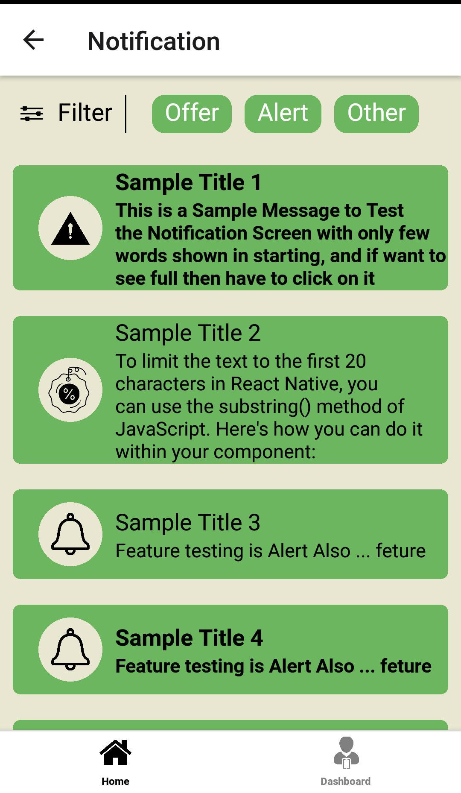
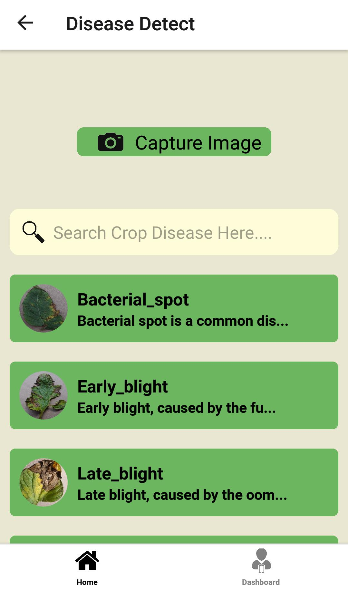

# Kisan Vikas - Frontend (React Native)

Welcome to the Kisan Vikas frontend repository! This repository contains the codebase for the Kisan Vikas mobile application built using React Native.

  
   
  
  
  
   
  

## Features

- **User Authentication:** Secure login and registration functionality for farmers.
- **Disease Detection:** Advanced image processing algorithms for detecting crop diseases.
- **Real-time Weather Updates:** Access to accurate weather forecasts for effective farming planning.
- **Farming Guidance:** Detailed recommendations for each stage of the farming process.
- **Market Insights:** Stay informed about crop prices and selling opportunities.
- **Push Notifications:** Receive real-time alerts and updates relevant to farming activities.
- **Multi-language Support:** Access the app in multiple languages for a personalized experience.

## Installation

1. Clone this repository to your local machine.
2. Navigate to the project directory in your terminal.
3. Run `npm install` to install the dependencies.
4. Run `npm start` to start the development server.

## How to Run

To run the development server:

1. Ensure you have a suitable development environment set up for React Native.
2. Run `npm start` to start the development server.
3. Follow the instructions provided to run the app on your desired platform (iOS/Android simulator or physical device).

## Project Structure

The project structure is organized as follows:

- `/src`: Contains the source code of the React Native application.
  - `/components`: Reusable components used throughout the app.
  - `/screens`: Screen components representing different sections of the app.
  - `/navigation`: Navigation setup using React Navigation.
  - `/redux`: Redux store configuration and actions.
  - `/services`: API service for making HTTP requests.
  - `/assets`: Static assets such as images, fonts, and other resources.
- `/android` and `/ios`: Platform-specific configurations for Android and iOS.

## Technologies Used

- React Native
- Redux for state management
- React Navigation for routing
- Axios for handling HTTP requests
- Firebase for user authentication
- TensorFlow.js for disease detection
- Internationalization (i18n) for multi-language support

